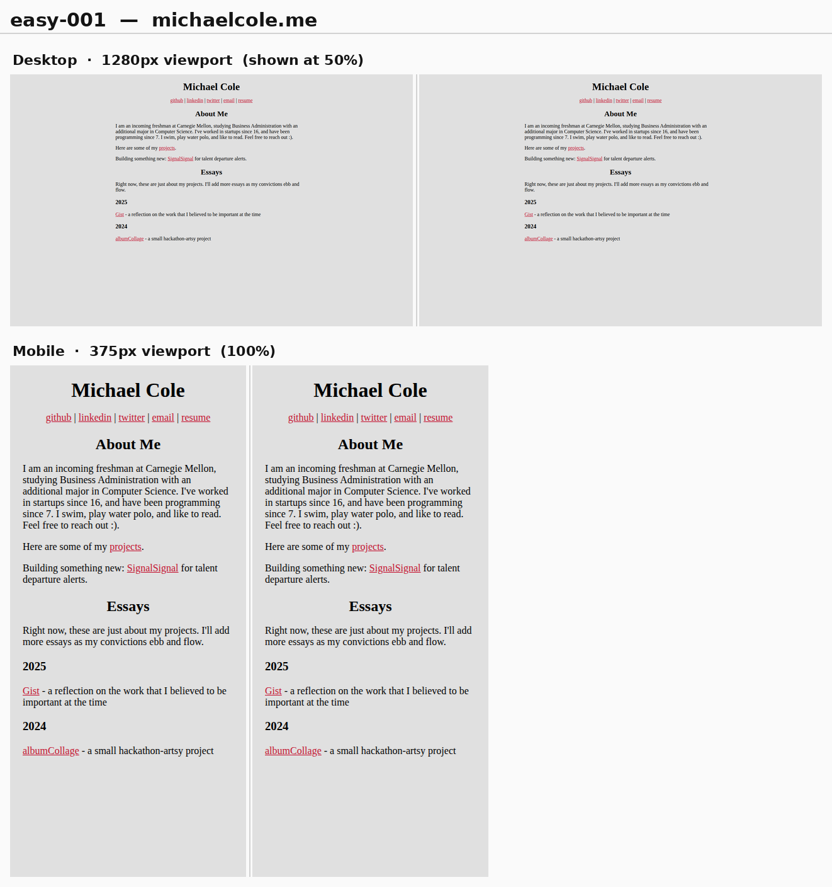
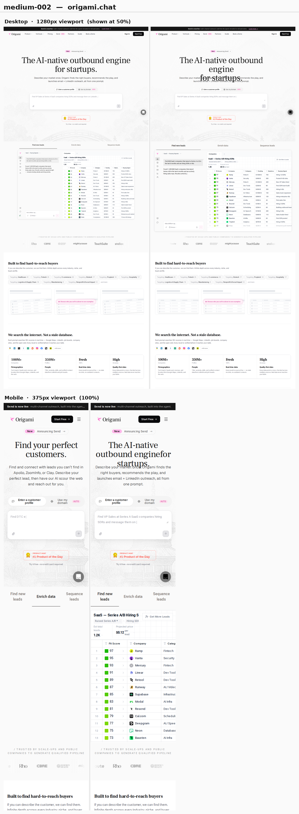

# Clone review — before / after

Side-by-side captures for the deterministic website cloner. Each image is one
site: **SOURCE (left) vs CLONE (right)**, with a desktop row (1280px, shown at
50%) on top and a mobile row (375px, 100%) below.

## Results

| Tier | Gates 0–6 | Avg score | Detail |
|------|:---------:|:---------:|--------|
| **easy** (24 personal/portfolio/content sites) | **24 / 24** | 99.7 | [easy/RESULTS.md](easy/RESULTS.md) |
| **medium** (23 SaaS / ecommerce marketing pages) | **16 / 23** | 98.9 | [medium/RESULTS.md](medium/RESULTS.md) |
| **hard** (32 dense editorial / docs / marketing / ecommerce) | **23 / 32** | 98.8 | [hard/RESULTS.md](hard/RESULTS.md) |
| **stage2** (25 popup / video / animation pages) | **22 / 25** | 99.1 | [stage2/RESULTS.md](stage2/RESULTS.md) |
| **sites** (5 multi-page sites, Stage 3) | **47 / 49 routes** | — | [sites/RESULTS.md](sites/RESULTS.md) |

**Stage 2** ("capture the right state") adds two gates beyond 0–6 — **pollution**
(degenerate / bot-wall / un-dismissed-modal capture) and **perceptual** (tier-
thresholded screenshot diff) — plus capture-time **overlay/popup dismissal**,
**animation settling**, and **dynamic-media first-frame**, and a single-load+resize
capture that keeps content identical across viewports. **19/25 also clear the
stricter stage-2 bar** (gates 0–6 + pollution + perceptual); browse [`stage2/`](stage2/).

**Stage 3** ("multi-page / whole-site") clones a whole site from one entry URL into
**one** Next.js app: it crawls routes, collapses CMS collections to one representative
(jamstack 552→11, 11ty 1085→12 reproduced routes), hoists shared header/footer chrome
into the layout, rewrites internal links to the clone routes, and adds site-level
**link-integrity** + **site-determinism** gates. **47/49 routes pass gates 0–6, all 5
sites green on links + determinism**; browse [`sites/`](sites/).

Gates 0–6 = build, capture, asset/font, DOM, computed-style, layout, determinism.
Every non-passing medium site still scores 95–99; the misses are documented
limitations (see below). Screenshots are a human sanity check on top of the
quantitative gates — browse them in [`easy/`](easy/) and [`medium/`](medium/).

## A few highlights

Pixel-perfect static reconstruction:

High-fidelity medium reconstruction:

## Known limitations (visible in some medium shots)

A static, deterministic clone reconstructs the captured **static** state. Content
driven by JS / time / scroll, or embedded from a third party, is **non-
deterministic frame-to-frame** and cannot be reproduced — the static scaffolding
(text, layout, materialized images) around it is still correct:

- **Rotating hero text** — shopify, notion (a JS timer swaps the word).
- **Scroll-scrubbed / autoplay hero video** — mercury (`<video>` frame depends on
  scroll position; the fallback image is reconstructed, behind the video).
- **`<iframe>` embeds** — loom (dropped to keep the clone self-contained).
- **Fancy multi-line headings** (per-word `inline-block` + spacers) stack a few px
  taller — linear, notion, deel.

Current architecture overview: [`../README.md`](../README.md).

## Generated app shape

The compiler emits a Next.js App Router + TypeScript project per site:
`src/app/page.tsx` (JSX reconstructed from the DOM), `src/app/ditto.css`
(clone-specific CSS that cannot be represented cleanly as utilities), and
`layout.tsx`. Larger clones additionally carry `public/assets/` (materialized
images/fonts/icons/manifests), generated documentation, and optional
`src/app/ditto/` runtime helpers. Regenerate any site with
`cd ../compiler && npm run bench -- --tier=medium`.
